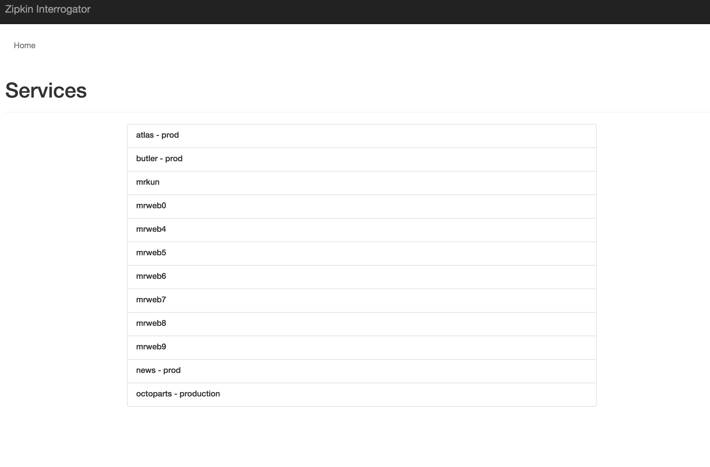
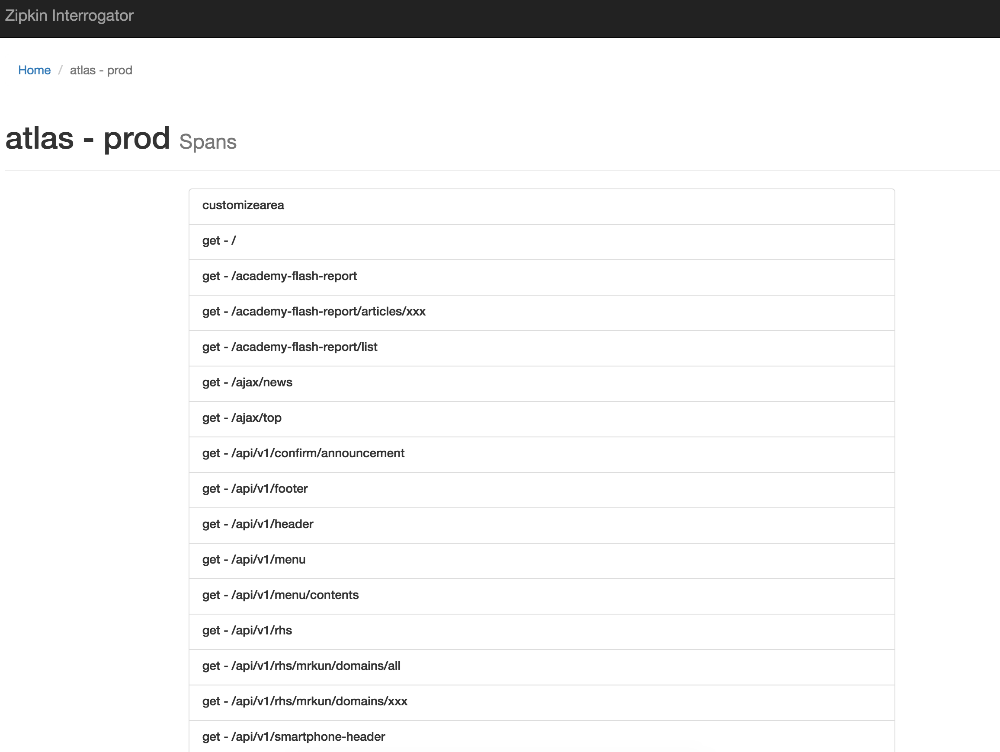
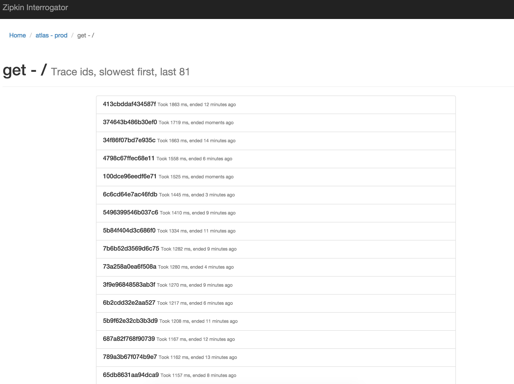
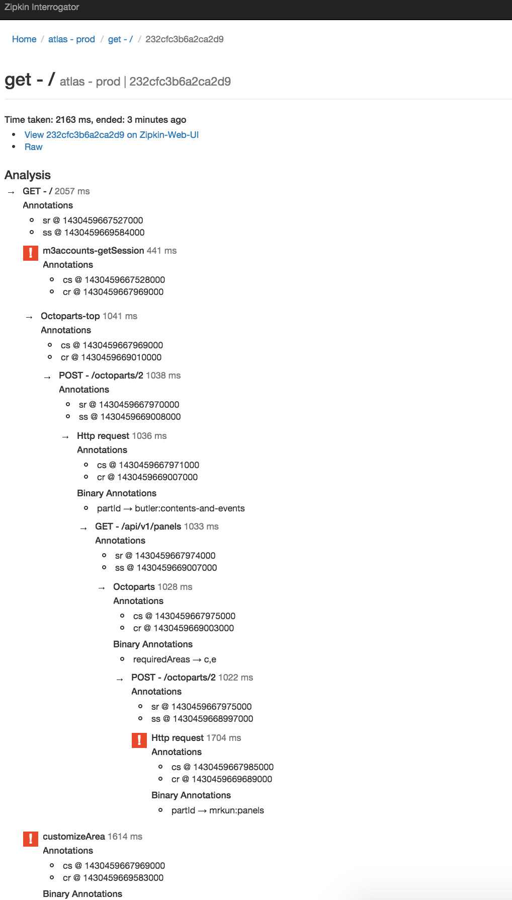

# Zipkin Interrogator

Note: There is an expectation that the reader understands what Zipkin is and what it is used for. (annotations such as 
'ss', 'sr', and 'cs' and 'cr' are not new to you). If you don't, here are a few great places to start:

- [Twitter's Blog entry on Zipkin](https://blog.twitter.com/2012/distributed-systems-tracing-with-zipkin)
- [Intro to Zipkin](http://itszero.github.io/blog/2014/03/03/introduction-to-twitters-zipkin/)
- [OpenZipkin on Gitlab](https://github.com/openzipkin)
  
At M3, our main frontend, [M3.com](https://www.m3.com) is a Scala Play app that talks to a large number of distributed
systems via [Octoparts](http://m3dev.github.io/octoparts/) in order to build up a page. To help us keep an eye on performance,
possible request loops, places where we should be doing things in parallel but arent, and general issues in production, 
one of the tools we use is Zipkin. 

Zipkin is great; it's implementation is based on [Google's Dapper whitepaper](http://research.google.com/pubs/pub36356.html) 
and it works well. However, a Trace from a single front-end request [can result in hundreds or thousands of spans](https://www.google.co.jp/search?q=zipkin+trace&espv=2&biw=1680&bih=908&source=lnms&tbm=isch&sa=X&ved=0ahUKEwjlvKPBi7XKAhXFHpQKHRYBAaYQ_AUIBigB#imgrc=J3544E6OANAQwM%3A), and
in our async architecture, _most_ of spans were happening in parallel, it became very difficult for us to identify bottlenecks
that were high in priority; **and thus Zipkin-Interrogator was born**

Zipkin-Interrogator is a Play application that connects to your Zipkin infrastructure, grabs trace and span data using the Zipkin 
Query API and digests that data for you to make it easy for you to understand where bottlenecks lie in your distributed
system.

## Moving parts

- Scala 2.11.x
- Play 2.3.x
- Thrift
- Zipkin libraries (e.g. Zipkin-common, Scrooge )
- Bootstrap 3

### Interesting things

This project auto-compiles the Zipkin Thrift interfaces defined in `/zipkin-thrift` using Twitter Scrooge (+ SBT plugin) and uses them.
Do not be surprised if you have red underlines in your IDE.

## How to use

1. Go to the root page (/) and pick a service

    

2. Pick a span name

    

3. Pick a trace id

    

4. Look at the analysis

    <a target="_blank" href="docs/images/analysis.png">
      <figure>
        
         
        <figcaption>The numbers next to the ss, sr, cs, and cr annotations are Epoch timestamps in milliseconds.</figcaption>
      </figure>
    </a>

## Legend

Accurate on release day :P

- A *Red* square with an exclamation mark denotes a *critical span*, meaning that it is the slowest amongst a group of
  spans that are running in parallel.
- A *Yellow* square with a question mark denotes a *non-ignorable span*, meaning that it is not the slowest amongst a group
  of spans that are running in parallel, but none-the-less, it is above 1 second in duration.
  
## License

Copyright 2016 M3, Inc.

Apache License, Version 2.0

http://www.apache.org/licenses/LICENSE-2.0.html